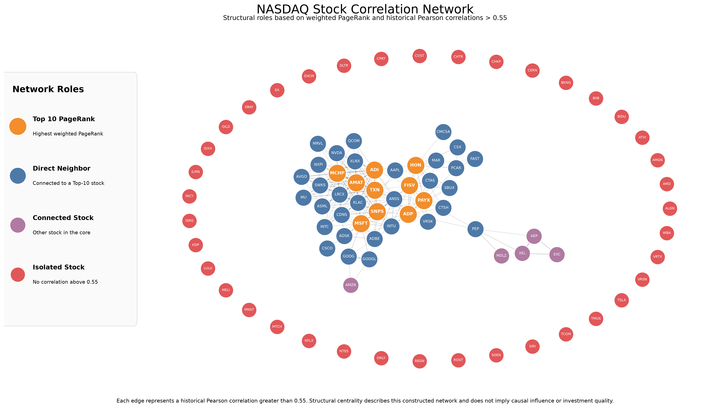
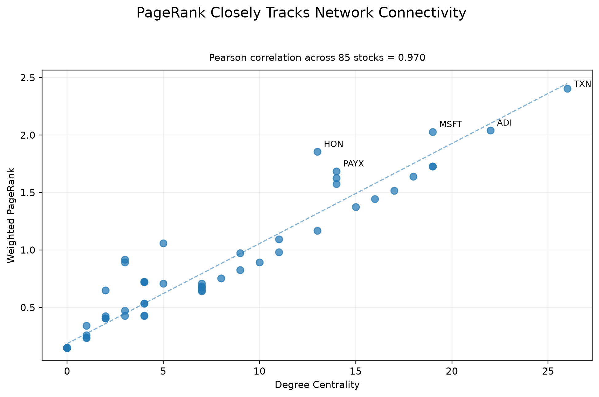
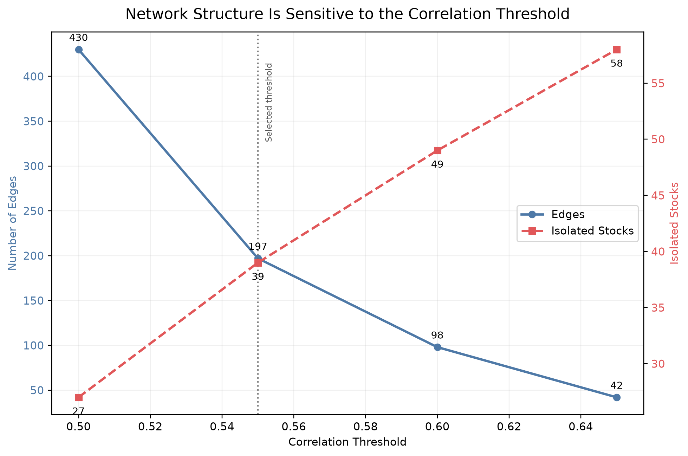

# NASDAQ Stock Network Analysis with Neo4j

**Python · Neo4j · Cypher · Graph Data Science · PageRank · NetworkX · Plotly**

Historical stock relationships are often presented as large correlation matrices that are difficult to interpret structurally. This project converts historical stock-return correlations into a graph, where stocks are represented as nodes and sufficiently strong correlations are represented as weighted relationships.

I use **Neo4j Graph Data Science (GDS)** to analyze connected components, degree centrality, and weighted and unweighted PageRank, then compare the measures and test the network's sensitivity to its correlation threshold.

> **Key finding:** PageRank identifies a highly connected core of stocks, but it is strongly correlated with simple degree centrality. Weighted PageRank and unweighted PageRank are also nearly identical, suggesting that PageRank primarily refines the ordering of an already well-connected group rather than revealing a completely different set of central stocks.

---

## Network Overview



The graph contains **85 stocks and 197 correlation relationships** at the selected Pearson correlation threshold of **0.55**.

An interactive version with company names, PageRank values, degree, and network status is also included:

[**View the interactive network HTML file**](visuals/correlation_network_interactive.html)

> GitHub does not execute interactive HTML directly inside a README. The file can be opened locally and is designed to be embedded in a portfolio website.

---

## Project Question

**How can historical stock-return relationships be represented as a graph, and what does network centrality reveal about the structure of co-movement among NASDAQ securities?**

The project focuses on three supporting questions:

1. Which stocks are most structurally central within the constructed correlation network?
2. Does PageRank provide meaningfully different information from simple degree centrality?
3. How sensitive are the network's conclusions to the correlation threshold used to create relationships?

This is a **network-structure analysis**, not a stock-prediction or trading model.

---

## Data Preparation

The local source dataset contains historical daily stock-price observations. The analysis pipeline uses **adjusted closing prices** to calculate daily log returns.

The preprocessing workflow:

```text
Raw daily prices
      ↓
Measure ticker history coverage
      ↓
Retain stocks with ≥ 90% date coverage
      ↓
Calculate daily log returns
      ↓
Pivot to date × ticker matrix
      ↓
Keep trading dates shared by all retained stocks
      ↓
2,791 trading dates × 85 stocks
```

The original local dataset contained:

| Metric | Value |
|---|---:|
| Raw observations | 271,680 |
| Raw tickers | 102 |
| Retained tickers | 85 |
| Excluded tickers | 17 |
| Minimum history requirement | 90% |
| Final trading dates | 2,791 |
| Final date range | 2010-08-09 to 2021-09-10 |
| Missing values | 0 |

The preprocessing logic is implemented in [`src/prepare_returns.py`](src/prepare_returns.py).

---

## Building the Correlation Network

Pearson correlations are calculated across the cleaned stock-return matrix.

Each retained stock becomes a node:

```text
(:Stock {ticker})
```

A relationship is created when two stocks have a historical Pearson correlation greater than **0.55**:

```text
(:Stock)-[:SIMILAR_TO {weight: correlation}]->(:Stock)
```

Only one relationship is stored for each stock pair. Because correlation is symmetric, Neo4j GDS projects these relationships as **undirected** for graph analysis.

### Network at the Selected Threshold

| Metric | Result |
|---|---:|
| Nodes | 85 |
| Stored relationships | 197 |
| Isolated stocks | 39 |
| Connected stocks | 46 |
| Connected components | 40 |
| Largest component | 46 |
| Graph density | 5.52% |
| Average degree | 4.64 |

The component structure is especially simple: the network contains **one connected core of 46 stocks plus 39 isolated stocks**.

Network construction is implemented in [`src/build_network.py`](src/build_network.py), while the Neo4j and GDS workflow is contained in [`cypher/graph_analysis.cypher`](cypher/graph_analysis.cypher).

---

## Neo4j Graph Analysis

The graph is loaded into Neo4j and projected into the Graph Data Science in-memory graph catalog as an undirected weighted network.

The analysis includes:

| Method | Purpose |
|---|---|
| **Weakly Connected Components** | Identify disconnected portions of the graph |
| **Degree Centrality** | Measure the number of direct relationships for each stock |
| **Unweighted PageRank** | Measure structural centrality while treating every qualifying relationship equally |
| **Weighted PageRank** | Incorporate correlation magnitude into PageRank |
| **Pearson Similarity** | Compare the resulting centrality measures |

### Top Stocks by Weighted PageRank

| Rank | Ticker | Degree | Weighted PageRank |
|---:|---|---:|---:|
| 1 | TXN | 26 | 2.4040 |
| 2 | ADI | 22 | 2.0410 |
| 3 | MSFT | 19 | 2.0286 |
| 4 | HON | 13 | 1.8562 |
| 5 | AMAT | 19 | 1.7287 |
| 6 | MCHP | 19 | 1.7282 |
| 7 | PAYX | 14 | 1.6860 |
| 8 | SNPS | 18 | 1.6394 |
| 9 | ADP | 14 | 1.6267 |
| 10 | FISV | 14 | 1.5741 |

Texas Instruments (`TXN`) is the most central stock under both degree and weighted PageRank.

However, PageRank does more than simply reproduce degree order. For example, **Honeywell (`HON`) has 13 direct relationships but ranks fourth in weighted PageRank**, illustrating how PageRank incorporates the structural importance of a node's neighbors in addition to its number of connections.

---

## Does PageRank Add Information Beyond Degree?



Across all 85 stocks:

| Comparison | Pearson Correlation |
|---|---:|
| Degree vs. unweighted PageRank | 0.971 |
| Degree vs. weighted PageRank | 0.970 |
| Unweighted vs. weighted PageRank | 0.999 |

The results show that **PageRank is highly correlated with degree centrality in this network**.

Weighted and unweighted PageRank are even more similar. Adding correlation magnitude changes individual PageRank values and some ordering, but does not fundamentally change the central structure of the network.

This is an important analytical result: a more sophisticated graph algorithm does not automatically produce a dramatically different answer.

---

## Threshold Sensitivity

A correlation network depends heavily on the threshold used to decide which relationships exist. Rather than treating `0.55` as an unquestionable parameter, I tested several nearby thresholds.



| Correlation Threshold | Edges | Isolated Stocks |
|---:|---:|---:|
| 0.50 | 430 | 27 |
| **0.55** | **197** | **39** |
| 0.60 | 98 | 49 |
| 0.65 | 42 | 58 |

Increasing the threshold rapidly removes relationships and creates additional isolates. Reducing it produces a much denser graph.

This sensitivity analysis shows that conclusions about network structure should be interpreted **conditional on the graph-construction rule** rather than as fixed properties of the stocks themselves.

---

## Interpretation

The analysis supports three main conclusions.

**First, the network contains a concentrated connected core rather than one uniformly connected market.** At the selected threshold, 46 stocks belong to one connected component while 39 have no qualifying relationships.

**Second, PageRank refines connectivity more than it replaces it.** Highly connected stocks dominate the upper PageRank rankings, but stocks such as HON demonstrate that the structure of neighboring relationships can still affect relative position.

**Third, relationship weighting has limited impact in this graph.** Weighted and unweighted PageRank correlate at approximately `0.999`, meaning correlation strength changes scores only marginally relative to the network's underlying connection structure.

These findings are descriptive of this **constructed historical correlation network**. They do not imply causal influence between companies.

---

## Technology Stack

| Tool | Use |
|---|---|
| **Python** | Data preparation, correlation analysis, graph construction, and visualization |
| **pandas / NumPy** | Data manipulation and return calculations |
| **Neo4j** | Property graph database |
| **Cypher** | Graph creation, validation, querying, and analysis workflow |
| **Neo4j Graph Data Science** | Connected components, degree centrality, PageRank, and similarity |
| **NetworkX** | Network construction support and visualization layout |
| **Matplotlib** | Static analytical visualizations |
| **Plotly** | Interactive network visualization |
| **Git / GitHub** | Version control and portfolio presentation |

---

## Repository Structure

```text
neo4j-stock-network-analysis/
│
├── README.md
├── requirements.txt
├── .gitignore
│
│
├── src/
│   ├── prepare_returns.py
│   ├── build_network.py
│   └── create_visuals.py
│
├── cypher/
│   └── graph_analysis.cypher
│
├── data/
│   └── processed/
│       ├── stocks.csv
│       ├── edges.csv
│       └── node_metrics.csv
│
└── visuals/
    ├── correlation_network.png
    ├── correlation_network_interactive.html
    ├── degree_vs_pagerank.png
    └── threshold_sensitivity.png
```

The large raw price dataset and intermediate log-return matrix are intentionally excluded from version control.

---

## Running the Project

### 1. Install Python Dependencies

```bash
python -m pip install -r requirements.txt

### 2. Prepare the Return Matrix

Place the source dataset at:

```text
data/raw/NASDAQ_100_Data_From_2010.csv
```

Then run:

```bash
python src/prepare_returns.py
```

This produces the local intermediate file:

```text
data/processed/log_returns.csv
```

### 3. Build the Graph Inputs

Run:

```bash
python src/build_network.py
```

This produces:

```text
data/processed/stocks.csv
data/processed/edges.csv
```

### 4. Load and Analyze the Graph in Neo4j

Copy `stocks.csv` and `edges.csv` into the Neo4j database import directory.

Then execute:

```text
cypher/graph_analysis.cypher
```

The Neo4j workflow:

```text
Create schema constraint
        ↓
Load Stock nodes
        ↓
Load SIMILAR_TO relationships
        ↓
Validate graph
        ↓
Create undirected GDS projection
        ↓
Analyze connected components
        ↓
Calculate degree
        ↓
Calculate unweighted PageRank
        ↓
Calculate weighted PageRank
        ↓
Compare centrality measures
```

The final node-level graph metrics are exported to:

```text
data/processed/node_metrics.csv
```

This file contains the degree, weighted PageRank, unweighted PageRank, and connected-component information used by the visualization pipeline.

### 5. Generate the Visualizations

With the processed data and Neo4j node metrics available, run:

```bash
python src/create_visuals.py
```

This produces:

```text
visuals/correlation_network.png
visuals/correlation_network_interactive.html
visuals/degree_vs_pagerank.png
visuals/threshold_sensitivity.png
```

The interactive HTML supports node hover details, zooming, and panning.

---

## Methodological Limitations

This project intentionally focuses on graph structure rather than prediction.

Historical correlation does **not** establish causation, business relationships, financial dependence, or future co-movement. The `0.55` threshold is a modeling decision and materially affects network density. Relationships below the threshold, including negative correlations, are not represented in the graph.

The analysis also uses a single historical return window rather than a rolling or time-varying network. PageRank should therefore be interpreted as **structural centrality within this specific historical correlation graph**, not as a measure of investment quality, expected return, risk, diversification benefit, or systemic importance.

---

## Project Origin and Contribution

This portfolio project is a **refactored and extended version of a collaborative graduate graph-analytics project**.

My original contribution focused on the **PageRank portion of the graph analysis**. For this portfolio version, I independently reconstructed and validated the preprocessing pipeline, rebuilt the correlation network, recreated the Neo4j implementation, added graph diagnostics, compared weighted and unweighted PageRank, added degree as a baseline, evaluated threshold sensitivity, and developed the static and interactive portfolio visualizations.

Analyses originally completed by other group members, such as Louvain community detection and betweenness centrality, are intentionally not presented here as my work.

---

## AI Assistance

AI tools were used to assist with portions of code drafting, visualization development, debugging, and code refinement.

I directed the analytical approach, made the graph-modeling and methodology decisions, validated the preprocessing and network outputs, executed the Neo4j analysis, evaluated the results, and reviewed the final implementation and interpretation.